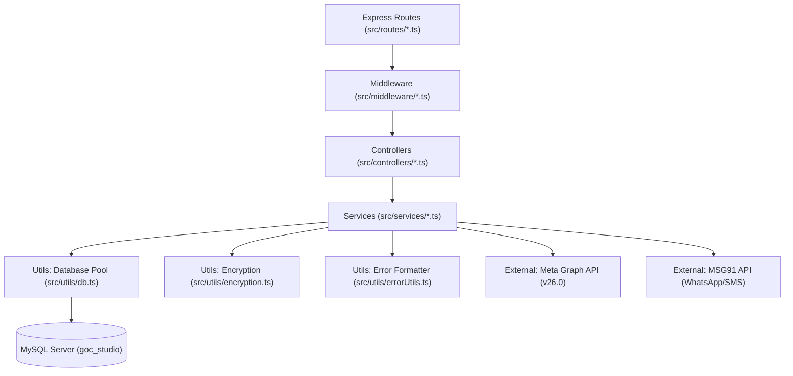
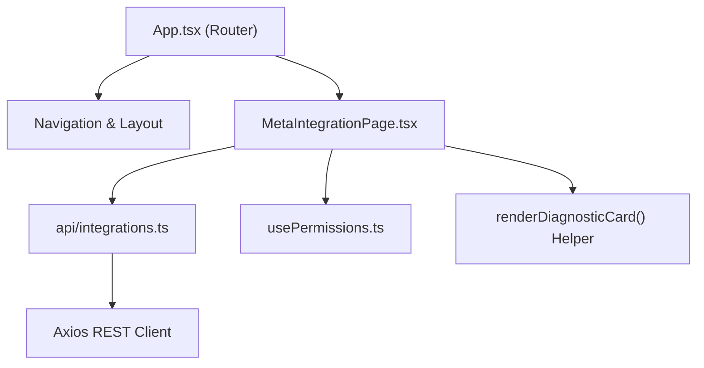

# SYSTEM DEPENDENCY GRAPH & MAPPING
## GOC STUDIO MANAGEMENT SYSTEM CRM

---

## 1. Backend Service Dependency Graph



---

## 2. Meta Lead Integration Core Chain

```
[POST /api/v1/webhooks/meta]
       │
       ▼
[receiveMetaWebhook()] in webhookController.ts
       │
       ▼
[processMetaWebhookAsync()] in webhookController.ts
       │
       ▼
[fetchMetaLeadFromGraph()] in metaLeadService.ts
       │
       ├──► [getMetaSettings()] in metaLeadService.ts
       │          │
       │          ▼
       │     [SELECT * FROM meta_integration_settings WHERE id = 1]
       │          │
       │          ▼
       │     [decrypt(page_access_token)] in encryption.ts
       │
       └──► [axios.get(https://graph.facebook.com/v26.0/{leadgen_id})]
                  │
                  ▼
            [formatExternalApiError()] in errorUtils.ts (on failure)
```

---

## 3. Frontend Component Dependency Graph


