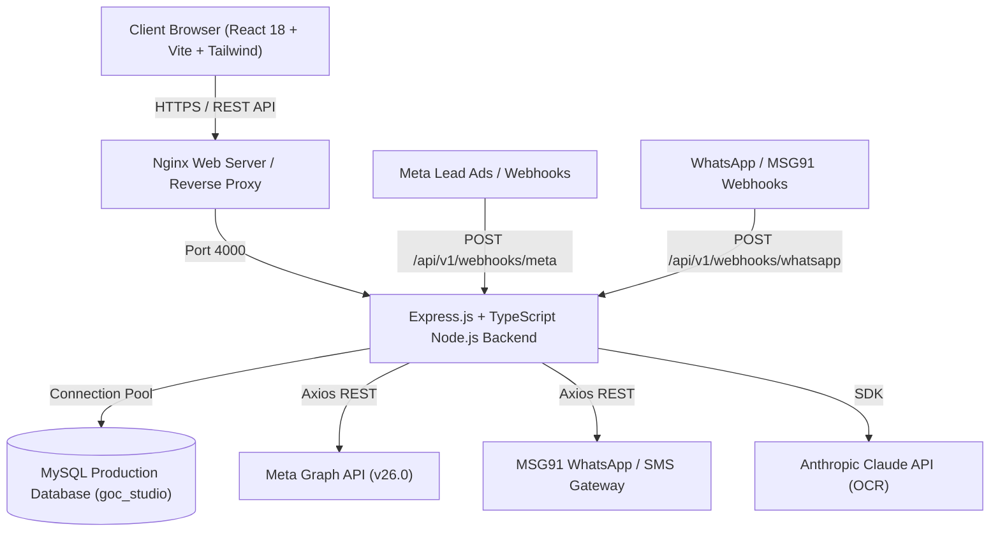

# SYSTEM ARCHITECTURE DOCUMENTATION
## GOC STUDIO MANAGEMENT SYSTEM CRM v2.0

---

## 1. System Overview & Technology Stack



### Stack Components:
- **Frontend**: React 18, Vite, TypeScript, TailwindCSS, Lucide Icons, React Query, React Router v6
- **Backend**: Node.js, Express.js, TypeScript, MySQL2 (Promises Pool), Axios, PM2
- **Database**: MySQL 8.0 (`goc_studio`), AES-256-CBC token encryption
- **Production Server**: Ubuntu Linux VPS (`72.61.243.180`), Nginx, PM2 process manager

---

## 2. Directory Structure

```
goc-software/
├── backend/
│   ├── src/
│   │   ├── config/          # Database pools & environment setup
│   │   ├── controllers/     # Route request handlers
│   │   ├── middleware/      # Auth, permission, CORS, rate limiting
│   │   ├── routes/          # Express route definitions
│   │   ├── services/        # Core business logic & external APIs
│   │   ├── types/           # TypeScript interfaces & types
│   │   ├── utils/           # Encryption, db helpers, error utilities
│   │   └── app.ts           # Express application setup
│   ├── server.ts            # Entrypoint & startup initialization
│   └── package.json
├── frontend/
│   ├── src/
│   │   ├── api/             # Axios API client functions
│   │   ├── components/      # Reusable UI components & layouts
│   │   ├── pages/           # CRM Page views
│   │   ├── utils/           # Permissions, formatters, state helpers
│   │   ├── App.tsx          # Main router & app entrypoint
│   │   └── main.tsx
│   └── package.json
├── database/
│   └── migrations/          # SQL database migration files
├── deploy_live.js           # Automated deployment script to VPS
└── README_AI.md             # AI Constitution entrypoint
```

---

## 3. End-to-End Execution & Request Lifecycle

### A. Authentication & Request Flow
1. User submits credentials at `POST /api/v1/auth/login`.
2. Backend verifies bcrypt hash in `users` table and issues JWT signed with `JWT_SECRET`.
3. Client attaches `Authorization: Bearer <token>` header to all API requests.
4. `authMiddleware` validates JWT signature and populates `req.user`.
5. `permissionMiddleware` verifies user role & permissions (`admin`, `staff`, `manager`).

### B. Meta Lead Ads Webhook Execution Flow
1. Meta sends lead notification payload to `POST /api/v1/webhooks/meta`.
2. `webhookController.ts` validates payload, logs raw payload into `webhook_logs` table.
3. Asynchronously invokes `processMetaWebhookAsync(entry)`:
   - Extract `leadgen_id`, `form_id`, `page_id`.
   - Check duplicate `leadgen_id` in `webhook_logs`.
   - Call `fetchMetaLeadFromGraph(leadgenId)`:
     - Query `meta_integration_settings` row #1 for encrypted token.
     - Decrypt `page_access_token` using `decrypt()`.
     - Execute `GET https://graph.facebook.com/v26.0/{leadgen_id}?access_token={token}`.
   - Normalize lead payload (`fullName`, `phone`, `email`, `requirement`, `vehicleMake`, `vehicleModel`).
   - Insert new record into `leads` table and update `created_lead_id` in `webhook_logs`.
   - Emit notification & trigger automated WhatsApp/SMS welcome message.

---

## 4. Environment & Startup Sequence

1. `server.ts` imports `app.ts` and loads `/root/goc-software/.env`.
2. Express server initializes port 4000 listening.
3. `validateMetaTokenArchitectureOnStartup()` executes:
   - Connects to MySQL pool.
   - Verifies row #1 in `meta_integration_settings`.
   - Tests AES-256-CBC token decryption.
   - Logs Token Architecture Diagnostics to PM2 stdout.
